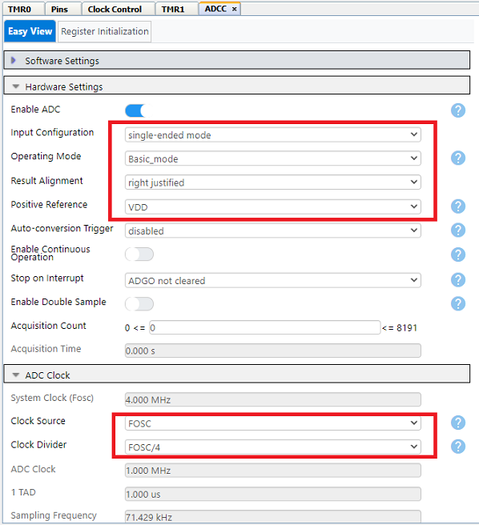
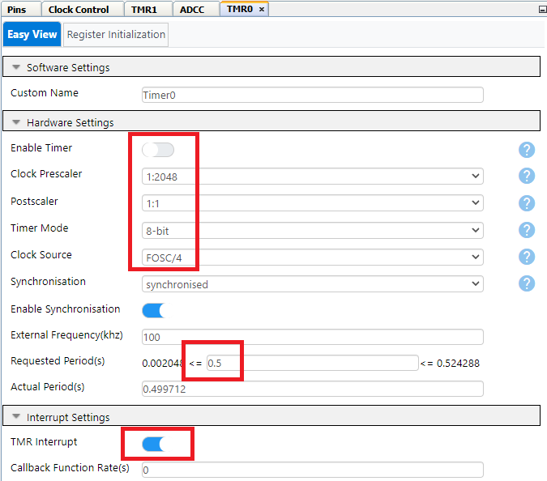
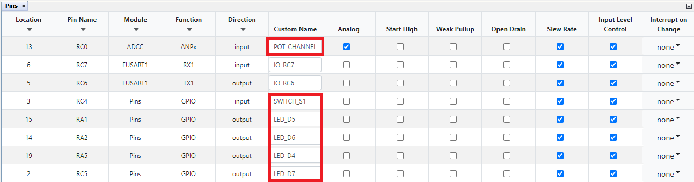
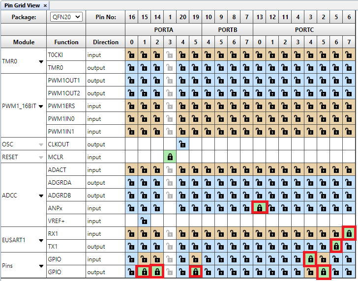

# Curiosity LPC demo code using PIC16F17146 Microcontroller

## Introduction

The following labs in this example are designed for Curiosity Low Pin Count (LPC) Development board. This development board supports 8, 14 and 20-pin 8-bit PIC® microcontrollers (MCUs). The MPLAB X project is developed with PIC16F17146 MCU and contains several labs that demonstrate various basic capabilities of PIC16F17146 family of devices. Each lab contains a brief description of the lab and discussions to make user easily familiar with the different peripherals of PIC16F17146 MCU. These labs also make use of the MPLAB Code Configurator (MCC), an easy-to-use plugin tool for MPLAB X IDE. MCC is used to setup the peripherals and generates drivers which can be used in the application code.

***Note :*** This example is also applicable for PIC16F18146 family of MCUs.

###### Curiosity Low Pin Count (LPC) Development Board

## Related Documentation

- [PIC16F17146 Data Sheet](https://www.microchip.com/DS40002343)
- [PIC16F18146 Data Sheet](https://www.microchip.com/DS40002339)

## Software Used

- MPLAB® X IDE [6.00 or newer](https://www.microchip.com/mplab/mplab-x-ide)
- Microchip XC8 Compiler [2.35 or newer](https://www.microchip.com/mplab/compilers)
- MPLAB® Code Configurator (MCC) [5.1.1 or newer](https://www.microchip.com/mplab/mplab-code-configurator)
- Microchip PIC16F1xxxx Series Device Support (DFP) [1.14.187 or newer](https://packs.download.microchip.com/)

## Hardware Used

-	[PIC16F17146 MCU with PDIP package](https://www.microchip.com/product/PIC16F17146)
-	[Curiosity Development Board (DM164137), Rev 4](https://www.microchip.com/development-tool/dm164137)

## LABs

The labs in this example are presented in the same order as they appear in the MPLAB X project. User can progress through each of the labs by pressing the S1 button on the board.

- [Lab 1: Hello World](https://github.com/microchip-pic-avr-examples/pic16f17146-curiosity-lpc-demo-code-mplab-mcc#lab-1-hello-world-gpio)
- [Lab 2: Blink](https://github.com/microchip-pic-avr-examples/pic16f17146-curiosity-lpc-demo-code-mplab-mcc#lab-2-blink-gpio-timer-1)
- [Lab 3: Rotate](https://github.com/microchip-pic-avr-examples/pic16f17146-curiosity-lpc-demo-code-mplab-mcc#lab-3-rotate-gpio)
- [Lab 4: Analog to Digital Conversion](https://github.com/microchip-pic-avr-examples/pic16f17146-curiosity-lpc-demo-code-mplab-mcc#lab-4-analog-to-digital-conversion-adcc-eusart-gpio)
- [Lab 5: Variable Speed Rotate](https://github.com/microchip-pic-avr-examples/pic16f17146-curiosity-lpc-demo-code-mplab-mcc#lab-5-variable-speed-rotate-adcc-eusart-gpio)
- [Lab 6: Pulse Width Modulation](https://github.com/microchip-pic-avr-examples/pic16f17146-curiosity-lpc-demo-code-mplab-mcc#lab-6-pulse-width-modulation-pwm-adcc-eusart)
- [Lab 7: Timers](https://github.com/microchip-pic-avr-examples/pic16f17146-curiosity-lpc-demo-code-mplab-mcc#lab-7-timers-timer-1-gpio)
- [Lab 8: Interrupts](https://github.com/microchip-pic-avr-examples/pic16f17146-curiosity-lpc-demo-code-mplab-mcc#lab-8-interrupts-timer-0-gpio)
- [Lab 9: Wake-up from Sleep Using Watchdog Timer](https://github.com/microchip-pic-avr-examples/pic16f17146-curiosity-lpc-demo-code-mplab-mcc#lab-9-wake-from-sleep-using-watchdog-timer-wwdt-gpio-sleep)
- [Lab 10: EEPROM](https://github.com/microchip-pic-avr-examples/pic16f17146-curiosity-lpc-demo-code-mplab-mcc#lab-10-eeprom-eeprom-adcc-gpio)

## Inputs and Display
-	Push Button Switch – Out of 2 on-board push button switches, only one switch S1 is utilized. S1 is connected to the MCU’s RC4 pin and is used to switch to the next lab. 
***Note :*** Press the push button switch S1 for sometime to move to the next lab.
-	Potentiometer – A 10kΩ potentiometer connected to the RC0 pin is used in the labs requiring analog inputs.
-	LEDs - The Curiosity LPC Board has four LEDs (D4 through D7) that are connected to pins RA5, RA1, RA2 and RA7, respectively. These LEDs are used to display the output of the different labs.
-	Terminal – The selected lab and its status is displayed on the PC terminal software. The MCU sends data to PC with baud rate of 9600 using EUSART with the help of virtual serial port feature of the on-board debugger. Pin RC6 is configured as MCU’s EUSART TX pin. **Connect this pin to the virtual serial port's RX pin (TX printed on Curiosity LPC Development board) using a jumper wire to observe data on the terminal.**

### Lab 1: Hello World (GPIO)
#### Introduction
This lab shows how to turn on an LED.
#### Hardware Effects
LED D4 will light up and stay lit.
#### Summary
The LEDs are connected to the general purpose input-output (GPIO) pins. First, the GPIO pin must be configured to be an output. In this case, when one of these pins is driven high (LED_D4 = 1), the LED will turn on. The two logic levels are derived from the power pins of the MCU. Since the MCU's power pin (VDD) is connected to 5V or 3.3V and the source (VSS) to ground (0V), a logic level of ‘1’ is equivalent to 5V or 3.3V, and a logic level of ‘0’ is 0V.

### Lab 2: Blink (GPIO, Timer 1)
#### Introduction
This lab shows how to blink an LED.
#### Hardware Effects
LED D4 blinks at a rate of approximately 1.5 seconds.
#### Summary
One way to create a delay is to spend time decrementing a variable. In assembly, the timing can be accurately programmed since the user will have direct control on how the code is executed. In 'C', the compiler takes the 'C' and compiles it into assembly before creating the file to program to the MCU (HEX file). Because of this, it is hard to predict exactly how many instructions it takes for a line of 'C' to execute. For a more accurate timing, this lab uses the MCU’s Timer 1 peripheral to produce the desired delay. Timer 1 is discussed in [Lab 7: Timers](https://github.com/microchip-pic-avr-examples/pic16f17146-curiosity-lpc-demo-code-mplab-mcc#lab-7-timers-timer-1-gpio).

### Lab 3: Rotate (GPIO)
#### Introduction
This lab is built upon Lab 1 and 2, which showed how to light up a LED and then make it blink using loops. This lab incorporates four onboard LEDs (D4, D5, D6 and D7) and the program will light up each LED in turn.
#### Hardware Effects
LEDs D4, D5, D6 and D7 light up in turn every 500 milliseconds. Once D7 is turned off, D4 lights up and the pattern repeats.
#### Summary
In C, we use Binary Left Shift and Right Shift Operators (<< and >>, respectively) to move bits around in the registers. The shift operations are 9-bit operations involving the 8-bit register being manipulated and the Carry bit in the STATUS register as the ninth bit. With the rotate instructions, the register contents are rotated through the Carry bit.

###### Left Shift Binary Operation
For example, for a certain register rotateReg, we want to push a ‘1’ into the LSB of the register and have the rest of the bits shift to the left, we can use the Binary Left Shift Operator (<<). We would first have to set up the Carry bit with the value that we want to push into the register before we execute shift instruction, as seen in the figure below.

###### Right Shift Binary Operation
Similarly, if we want to push a ‘1’ into the MSB of the register and have the rest of the bits shift to the right, we can use the Binary Right Shift Operator (>>). We would first have to set up the Carry bit with the value that we want to push into the register before we execute shift instruction, as seen in the figure below.

### Lab 4: Analog to Digital Conversion (ADCC, EUSART, GPIO)
#### Introduction
This lab shows how to configure the ADCC, run a conversion, read the analog voltage, controlled by the on-board potentiometer, print the conversion result using EUSART and display four most significant bits on the LEDs.
#### Hardware Effects
The four most significant bits of the ADCC result are reflected onto each of the four LEDs D4, D5, D6 and D7 respectively. Rotate the potentiometer to change the display.
The ADCC value is displayed on PC terminal software.
#### Summary
The PIC16F17146 family of devices has an on-board Differential Analog-to-Digital Converter with Computation (ADCC) with 12 bits of resolution. The ADCC can be referenced to the device’s VDD or Fixed Voltage Reference (FVR) module or an external voltage reference. This lab references it to VDD. The negative voltage reference is internally connected to VSS. The result from the ADCC is represented by a ratio of the voltage to the reference. The ADCC can either function in single-ended or differentia mode. In single-ended conversions, the ADCC measures the voltage between the selected analog input and VSS(0V). In differential conversions, the ADCC measures the voltage difference between two selected analog inputs. The selected ADCC input channels can either be from an internal source, such as the Operational Amplifier’s output, or from external analog input pins. In this lab, ADCC is configured in single ended mode and input analog voltage is supplied by on-board potentiometer.

### Lab 5: Variable Speed Rotate (ADCC, EUSART, GPIO)
#### Introduction
This lab combines all the previous labs to produce a variable speed rotating LED display that is proportional to the ADCC value. The ADCC value and LED rotate speed are inversely proportional to each other.
#### Hardware Effects
Rotate the on-board potentiometer to change the speed of the LEDs shift (LEDs D4 to D7).
The ADCC value is displayed on PC terminal software.
#### Summary
The LEDs are light up from D4 to D7 at a speed determined by ADCC value which is controlled by on-board potentiometer.
###### Program Flow

### Lab 6: Pulse Width Modulation (PWM, ADCC, EUSART)
#### Introduction
In this lab, the MCU generates a PWM signal that lights up an LED with the potentiometer controlling the brightness.
#### Hardware Effects
Rotating potentiometer will adjust the brightness of LED D7.
The ADCC value is displayed on PC terminal software.
#### Summary
The PIC16F17146 has 2 (2 channels each) 16-bit PWM peripherals. Pulse Width Modulation is a technique that provides power to a load by switching quickly between fully ON and fully OFF states. The PWM signal resembles a square wave where the high portion of the signal is considered the ON state and the low portion of the signal is considered the OFF state. The high portion, also known as the pulse width, can vary in time and is defined in steps. A longer, high ON time will illuminate the LED brighter. Similarly, brightness decreases as the high ON time is for short duration. The frequency or period of the PWM does not change. The PWM period is defined as the duration of one cycle or the total amount of ON and OFF time combined. Another important term to take note is the PWM duty cycle which is the ratio of the pulse width to the period and is often expressed in percentage. A lower duty cycle corresponds to less power applied and a higher duty cycle corresponds to more power applied.
In this Lab, the analog input provided by on-board potentiometer determines the duty cycle of PWM. As the potentiometer rotates, the ADCC value changes thereby varying the brightness of LED D7.

### Lab 7: Timers (Timer 1, GPIO)
#### Introduction
This lab will produce the same output as [Lab 3: Rotate](https://github.com/microchip-pic-avr-examples/pic16f17146-curiosity-lpc-demo-code-mplab-mcc#lab-3-rotate-gpio). The only difference is that this version uses Timer 1 to provide the delay routine.
#### Hardware Effects
LEDs rotate from right to left, similar as Lab 3: Rotate (GPIO).
#### Summary
Timer 1 (TMR1) is a peripheral that uses two 8-bit paired registers (TMR1H:TMR1L) to implement a 16-bit timer/counter in the processor. When used with an internal clock source, the peripheral acts a timer that increments on every instruction cycle. When used with an external clock source, the peripheral can be used as either a timer or counter and increments on every selected edge of the external source. It may be used to count instruction cycles or external events that occur at or below the instruction cycle rate.
This lab configures TMR1 to count instruction cycles and to set a flag when it rolls over. It functions as a timer, generating required delay routine. This frees up the processor to do meaningful work rather than wasting instruction cycles in a timing loop. Using a counter provides a convenient method of measuring time or delay loops as it allows the processor to work on other tasks rather than counting instruction cycles.

### Lab 8: Interrupts (Timer 0, GPIO)
#### Introduction
This lab discusses all about interrupts – its purpose, capabilities and how to set them up. Most interrupts are sourced from MCU’s peripherals. Some GPIO pins can also be configured to generate interrupts whenever a change in state is detected. Interrupts usually signal events that require servicing by the software’s Interrupt Service Routine (ISR). Once an interrupt occurs, the program counter immediately jumps to the ISR and once the Interrupt Flag is cleared, resumes what it was doing before. It is a rather more efficient way of watching out for events than continuously polling a bit or register.
#### Hardware Effects
LEDs D7, D6, D5 and D4 rotate from left to right at a constant rate of 500 ms
#### Summary
This lab demonstrates the advantage of using interrupts over polling. The lab uses Timer 0 (TMR0) to generate a delay routine of 500 ms between lighting up each LED in turn. An interrupt is generated whenever the TMR0 register reaches 0xFF and goes back to reset value. This indicates that 500 ms has passed and it is time to rotate the light. This interrupt is serviced by the TMR0_ISR() function. Note that this is the same for [Lab 7: Timers](https://github.com/microchip-pic-avr-examples/pic16f17146-curiosity-lpc-demo-code-mplab-mcc#lab-7-timers-timer-1-gpio) but this time, CPU is not continuously watching the TMR1 interrupt flag.

### Lab 9: Wake from Sleep using Watchdog Timer (WWDT, GPIO, SLEEP)
#### Introduction
This lab will introduce the Sleep mode. SLEEP() function is used to put the device into a low power standby mode where the CPU and other peripherals cease to operate.
#### Hardware Effects
The watchdog timer is enabled before SLEEP() function due to which it starts counting in Sleep mode. LEDs D4 & D6 are turned ON and LEDs D5 & D7 are turned OFF before entering the Sleep mode, thus the status of LEDs remains same during the Sleep mode. Pressing the switch would not go to the next lab since the MCU is in Sleep mode. After the watchdog timer has reached its period, which is approximately 4 seconds for this lab, the MCU exits the sleep mode, and the four LEDs are toggled.
#### Summary
The Power-Down mode is entered by executing the SLEEP instruction.

The Watchdog Timer (WDT) is a system timer that generates a Reset if the firmware does not issue a CLRWDT instruction within the time-out period. WDT is typically used to recover the system from unexpected events. When the device enters Sleep, the WDT is cleared. If the WDT is enabled during Sleep, the WDT resumes counting. When the device exits Sleep, the WDT is cleared again. When a WDT time-out occurs while the device is in Sleep, no Reset is generated. Instead, the device wakes up from sleep and resumes operation. The Windowed Watchdog Timer (WWDT) differs from nonwindowed operation in that CLRWDT instructions are only accepted when they are performed within a specific window during the time-out period

### Lab 10: EEPROM (EEPROM, ADCC, GPIO)
#### Introduction
This lab provides code for writing and reading a single byte onto the MCU’s EEPROM. EEPROM is nonvolatile memory, meaning that it does not lose its value when power is shut off. This is unlike RAM, which will lose its value when no power is applied. The EEPROM is useful for storing variables that must still be present during no power. A good use case is to store calibration data for the user application and have it loaded on every boot-up.
#### Hardware Effects
The top 4 MSBs of the adcc is written to EEPROM. These are read afterwards and displayed on the LEDs D4 through D7. Rotating the potentiometer changes value of the adcc to be written to and read from EEPROM.
The status of EEPROM read and write is displayed on PC terminal software.
#### Summary
This lab has a similar appearance to [Lab 4: Analog to Digital Conversion](https://github.com/microchip-pic-avr-examples/pic16f17146-curiosity-lpc-demo-code-mplab-mcc#lab-4-analog-to-digital-conversion-adcc-eusart-gpio). But instead of directly moving the ADCC result directly onto the LEDs, it performs a simple “write” and “read” on the EEPROM. As shown on figure below, the top 4 MSBs of the ADCC result is first written to EEPROM and retrieved later from the same address before moving onto the LEDs.
###### Program Flow

## Peripheral Configuration
This section explains how to configure the peripherals using MPLAB X IDE with MCC plugin for recreation of the project.

Refer [Software Used](https://github.com/microchip-pic-avr-examples/pic16f17146-curiosity-lpc-demo-code-mplab-mcc#software-used) section to install required tools to recreate the project.

Additional Links: [MCC Melody Technical Reference](https://onlinedocs.microchip.com/v2/keyword-lookup?keyword=MCC.MELODY.INTRODUCTION&redirect=true)

###### Peripheral Configuration Summary
|    Module                  |    Configuration                                                                                                                                                                                                                                                                                                                                                                                                                                    |    Usage                                         |
|--------------------------------|---------------------------------------------------------------------------------------------------------------------------------------------------------------------------------------------------------------------------------------------------------------------------------------------------------------------------------------------------------------------------------------------------------------------------------------------------------|------------------------------------------------------|
|    Clock Control           |    Clock Source   - HFINTOSC    HF Internal Clock – 4 MHz    Clock Divider - 1                                                                                                                                                                                                                                                                                                                                                                |    System clock                                  |
|    Configuration   Bits    |    External Oscillator not enabled     Reset Oscillator - HFINTOSC (16MHz)     WDT Period Select bits – Divider ratio 1:65536; software control of WDTPS    WDT Operating Mode bits – WDT enabled/disabled by SEN bit    WDT window Select bits – window always open (100%); software control; keyed access not   required    WDT Input Clock Select bits – WDT reference clock is 32 kHz MFINTOSC    |    Clock and Watchdog settings                   |
|    TMR1                    |    Clock Source – MFINTOSC_31.25kHz    Prescaler – 1:1      Timer Period – 0.5 s                                                                                                                                                                                                                                                                                                                                                       |    Time base for LED blink  (Lab 3 & 7)       |
|    ADCC                    |    Enable ADCC    Input Configuration- Single Ended Mode    Operating Mode – Basic Mode    Result Alignment – Right justified    Positive Reference – VDD         Clock Source   – FOSC   Clock Divider   – FOSC/4                                                                                                                                                                               |    Monitor potentiometer (Lab 4, 5, 6, 10)    |
|    UART                 |    UART1 Driver    Requested Baudrate - 9600   UART PLIB Selector - EUSART1        EUSART1 PLIB   Redirect STDIO to EUSART      Enable Receive  Enable Transmit   Enable Serial Port                                                                                                                                                                                                                                                                                      |    Send data to PC terminal                      |
|    PWM1 16-bit             |    Enable PWM    Clock Source – HFINTOSC      Mode – Left aligned mode   Requested Frequency – 0.1 kHz                                                                                                                                                                                                                                                                             |    Control brightness of LED (Lab 6)          |
|    TMR0                    |    Disable Timer      Clock Prescaler – 1:2048       Timer Mode – 8-bit    Clock Source - FOSC/4    Requested Period – 0.5 s        Enable Interrupt                                                                                                                                                                                                                       |    Timer base for LED blink  (Lab 8 )          |
|    WWDT                     |    Disable Watchdog Timer   Window open time -  Window delay time 0%    Watchdog time-Out period – 1:131072                                                                                                                                                                                                                                                                                                                          |    Wakeup from sleep mode (Lab 9)             |
|    NVM                     |   Disable Generate Flash  APIs     Enable Generate EEPROM APIs                                                                                                                                                                                                                                                                                                                                                                                                                      |    Access EEPROM (Lab 10)                     |

##### Peripheral Configuration using MCC
###### Clock control

###### Configuration Bits

###### TMR1

###### ADCC

###### UART1 Driver

###### EUSART1 PLIB

###### PWM

###### TMR0

###### WWDT

###### NVM

###### Pins

###### Pin Grid View

## Summary
This code example demonstrated usage of various peripherals of PIC16F17146 family of microcontrollers.
